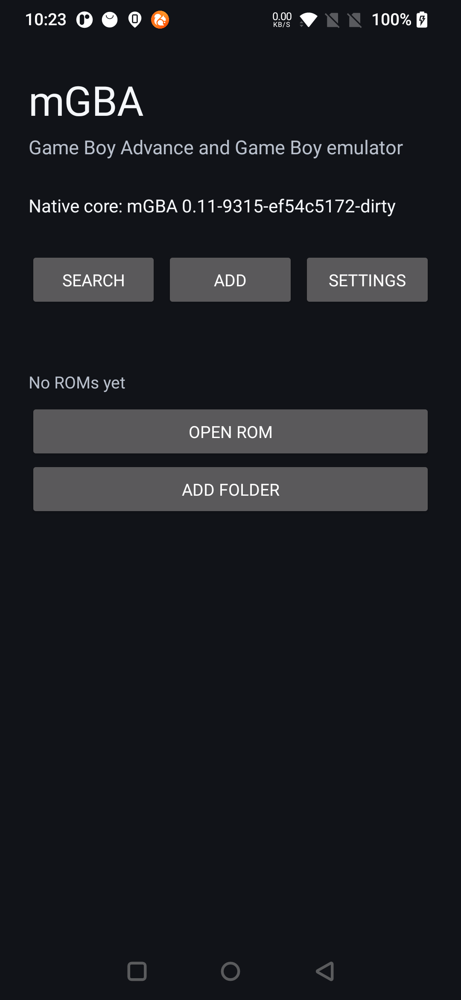
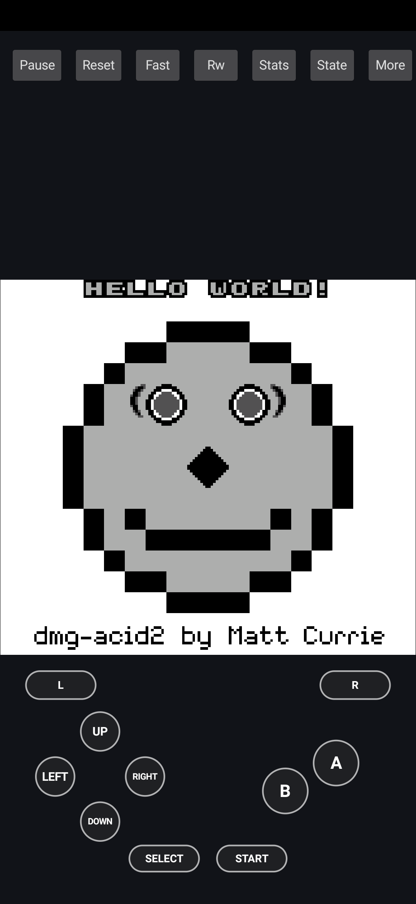
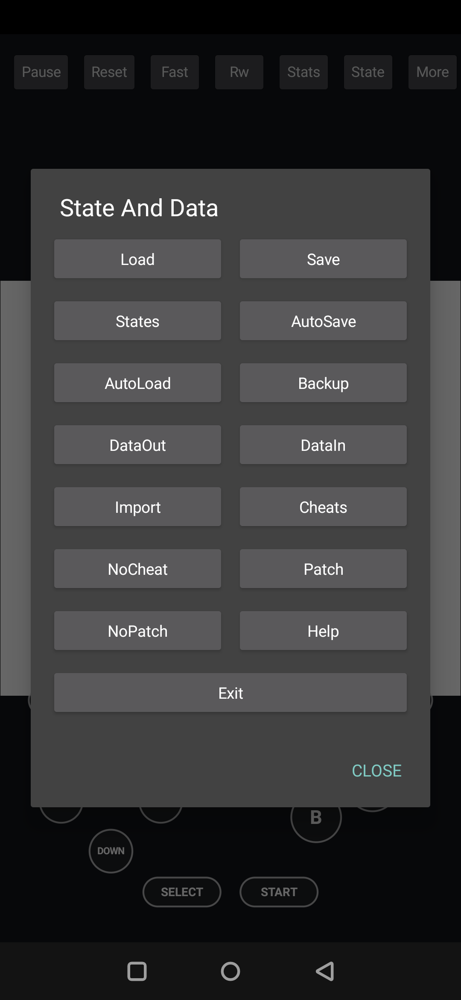
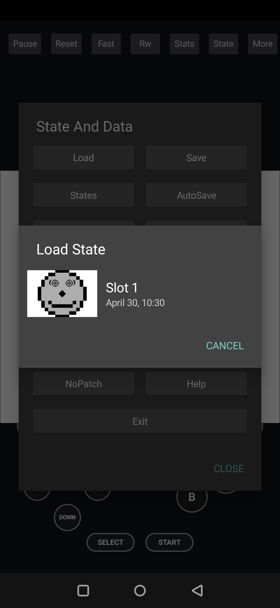
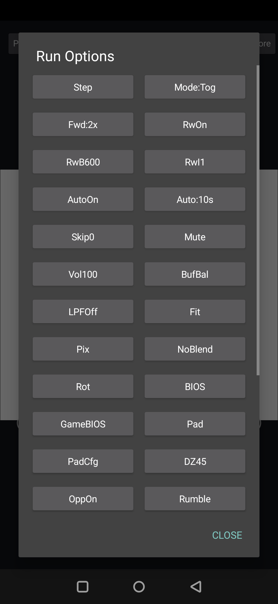
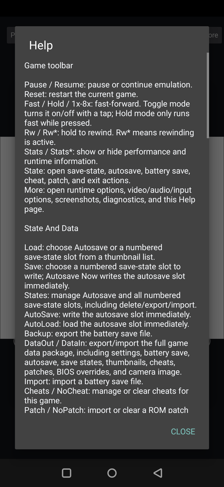

# mGBA Android

This directory contains the native Android frontend for mGBA. It uses Android
Activity/View APIs for the app shell, JNI/NDK for the emulator bridge, and the
existing mGBA C/C++ core for Game Boy, Game Boy Color, Super Game Boy, and Game
Boy Advance emulation.

The Android app is intentionally built as a native frontend rather than a web
wrapper. It supports local ROM picking and folder scanning, touch controls,
hardware input mapping, audio/video/runtime options, save states, autosave,
data import/export, screenshots, diagnostics, localization, and release build
plumbing.

## Screenshots

The screenshots below were captured on a OnePlus 7 with the checked-in Android
smoke-test ROM asset. No commercial ROMs are bundled with the app.

| Home | Game screen |
| --- | --- |
|  |  |

| State and data | Load state thumbnails |
| --- | --- |
|  |  |

| Runtime options | Built-in help |
| --- | --- |
|  |  |

## What Is Implemented

### App Shell And Library

- Native Android launcher activity with a ROM library, recent-game list, search,
  and list/grid display modes.
- File picker support for `.agb`, `.gba`, `.gb`, `.gbc`, `.sgb`, `.zip`, and
  `.7z` files.
- Folder scanning through Android's Storage Access Framework, including
  persisted folder access and rescans.
- Archive handling for ROMs inside supported compressed files.
- Per-ROM identity tracking for settings, save data, thumbnails, cheats,
  patches, and screenshots.
- Optional cover import for library entries.
- Global settings import/export.
- App log export and private storage inspection tools.

### Emulation Runtime

- JNI bridge to the mGBA native core.
- OpenGL ES video presentation with configurable scale modes, filtering,
  interframe blending, frame skip, and rotation behavior.
- Android audio output with low-latency, balanced, and stable buffer presets.
- Volume, mute, and low-pass filter controls.
- Pause/resume, reset, fast-forward, rewind, screenshots, runtime diagnostics,
  and optional internal GDB stub support for development builds.
- Game Boy, Game Boy Color, Super Game Boy, and Game Boy Advance ROM loading
  through the shared mGBA core.

### Input

- On-screen virtual gamepad with D-pad, A/B, L/R, Start, and Select.
- Configurable virtual pad size, spacing, opacity, haptics, handedness, and
  layout.
- A/B placement tuned for one-handed and two-handed touch use.
- Hardware keyboard/controller mapping UI.
- Analog deadzone configuration.
- Opposing-direction policy toggle.
- Rumble toggle.
- Tilt calibration and tilt enable/disable controls.
- Solar sensor/manual level controls for games that use the light sensor path.
- Camera image import/capture path for Game Boy Camera-style input.

### Save, Autosave, And Data Portability

- Numbered save-state slots with thumbnail capture.
- Load-state picker that shows occupied slots with thumbnails and timestamps.
- Manual autosave and autoload controls.
- Periodic autosave while a game screen is active.
- Default autosave interval: `10s`.
- Configurable autosave interval range: `5s` to `600s`.
- Automatic save on pause/exit when Auto State is enabled.
- Battery save import/export.
- Full per-game data package export/import through `DataOut` and `DataIn`,
  including:
  - global/per-game settings relevant to that game
  - battery save
  - autosave
  - numbered save states
  - save-state thumbnails
  - cheats
  - patches
  - BIOS overrides
  - camera image source

### Speed, Language, And Help

- Fast-forward modes:
  - `Toggle`: tap Fast once to enable and again to disable.
  - `Hold`: run fast only while the Fast control is pressed.
- Fast-forward multipliers:
  - `1x`
  - `1.25x`
  - `1.5x`
  - `2x`
  - `3x`
  - `4x`
  - `8x`
- Fast-forward applies through the native runner so video pacing and audio
  generation are advanced together.
- Language setting:
  - English
  - Simplified Chinese
  - Traditional Chinese
  - Japanese
  - Russian
- Built-in Help dialog covering toolbar buttons, state/data buttons, settings,
  and value meanings.

### Release And Debug Support

- Gradle wrapper pinned for reproducible local and CI builds.
- Android Gradle Plugin and NDK configuration checked into the project.
- Debug and release build types.
- Release signing through Gradle properties or environment variables.
- Native symbol ZIP generation for release crash symbolication.
- Android lint configuration.
- Android-specific third-party notices.
- Asset guard script to prevent ROMs, saves, BIOS files, and similar data from
  being accidentally bundled into `app/src/main`.

## Using The App

### Add Games

1. Install or launch the Android app.
2. Tap `Add`.
3. Choose `Open ROM` to select one ROM/archive, or choose `Add Folder` /
   `Scan Folder` to index a directory.
4. Pick a supported file or folder through the Android file picker.
5. Tap a game in the library to start it.

The app does not ship with ROMs, BIOS files, cheats, patches, or save data.
Users must provide their own legally obtained files.

### Main Game Controls

The top game toolbar contains:

| Button | Purpose |
| --- | --- |
| `Pause` / `Resume` | Pause or continue emulation. |
| `Reset` | Restart the current game. |
| `Fast` / `Hold` / multiplier label | Control fast-forward. |
| `Rw` / `Rw*` | Hold to rewind; `Rw*` means rewind is active. |
| `Stats` / `Stats*` | Show or hide performance/runtime stats. |
| `State` | Open save-state, autosave, battery save, cheat, patch, and exit actions. |
| `More` | Open runtime, video, audio, input, screenshot, diagnostics, and Help actions. |

The virtual controls are overlaid below the video area. Use `More` -> `Pad` or
`PadCfg` to hide/show the pad or tune layout details.

### Save And Load State

1. Open a game.
2. Tap `State`.
3. Tap `Save` to write a numbered slot.
4. Tap `Load` to choose an occupied slot from the thumbnail list.
5. Tap `States` for delete/export/import management.

`AutoSave` writes the autosave slot immediately. `AutoLoad` loads the autosave
slot immediately.

### Autosave

Auto State is enabled by default. When enabled:

- the autosave is loaded when a game starts, if one exists;
- a new autosave is written every configured interval while the game screen is
  active;
- another autosave is written when the game pauses or exits.

To change the interval:

1. Open `More` from the game screen, then tap `Auto:10s`, or open the main
   `Settings` panel and tap the Auto Interval button.
2. Enter a value in seconds.
3. Values are clamped to the supported `5-600` second range.

Use `AutoOn` / `AutoOff` to enable or disable automatic autosave/autoload for
the current runtime settings. Manual `AutoSave` and `AutoLoad` still work when
automatic Auto State is off.

### Runtime Options

Open `More` from the game screen to adjust runtime behavior:

| Control | Meaning |
| --- | --- |
| `Step` | Advance emulation by one step while paused. |
| `Mode:Tog` / `Mode:Hold` | Change fast-forward activation mode. |
| `Fwd:<value>` | Cycle fast-forward speed. |
| `RwOn` / `RwOff` | Enable or disable rewind support. |
| `RwB<value>` | Rewind buffer size. Larger values keep more history and use more memory. |
| `RwI<value>` | Rewind interval. Lower values are smoother; higher values use less memory. |
| `AutoOn` / `AutoOff` | Toggle automatic autosave/autoload behavior. |
| `Auto:<seconds>` | Configure periodic autosave interval. |
| `Skip<value>` | Frame skip amount. |
| `Mute` / `Sound` | Mute or restore audio. |
| `Vol<value>` | Output volume percentage. |
| `Buf<mode>` | Audio buffer preset. |
| `LPF<value>` | Low-pass filter strength. |
| `Fit` / `Fill` / `Integer` / `Original` / `Stretch` | Video scaling mode. |
| `Pix` / `Smooth` | Video filtering mode. |
| `Blend` / `NoBlend` | Interframe blending. |
| `Rot` | Rotation behavior. |
| `BIOS` / `GameBIOS` | Global or per-game BIOS controls. |
| `Pad` / `PadCfg` | Virtual gamepad visibility and layout settings. |
| `DZ<value>` | Analog deadzone. |
| `OppOn` / `OppOff` | Opposing direction policy. |
| `Rumble` | Rumble toggle. |
| `Tilt` / `Cal` | Tilt input and calibration. |
| `Solar` | Solar/light sensor controls. |
| `Camera` | Camera image source controls. |
| `Keys` | Hardware key/controller mappings. |
| `Shot` / `Export` | Screenshot capture and export. |
| `Diag` | Export runtime diagnostics. |
| `Help` | Open the built-in help reference. |

The optional `GDB` control appears only in builds compiled with the Android GDB
stub enabled.

### Cheats, Patches, BIOS, And Saves

- Use `State` -> `Cheats` to import/manage cheats for the current game.
- Use `State` -> `NoCheat` to clear cheats for the current game.
- Use `State` -> `Patch` to import a ROM patch for the current game.
- Use `State` -> `NoPatch` to clear the current game's patch.
- Use the main `Settings` panel for global BIOS import/clear controls.
- Use `State` -> `Backup` and `State` -> `Import` for battery save export/import.
- Use `State` -> `DataOut` and `State` -> `DataIn` to move full per-game data
  between devices or builds.

### Localization

Open the main `Settings` panel and use `Language` to cycle through:

- English
- Simplified Chinese
- Traditional Chinese
- Japanese
- Russian

The selected language is stored in app preferences and applied when activities
are created.

## Toolchain

- Android Gradle Plugin: `9.1.0`
- Gradle: `9.3.1`
- JDK: `17`
- Default NDK: `28.2.13676358`
- Android namespace/application ID: `io.mgba.android`
- Minimum SDK: `23`
- Target SDK: `36`

The checked-in Gradle wrapper pins Gradle `9.3.1` for reproducible local and CI
builds.

## Build

Install Android Studio or configure `ANDROID_HOME`, then run:

```bash
cd src/platform/android
./gradlew :app:assembleDebug
```

To build a subset of ABIs locally or in CI, pass a comma-separated filter:

```bash
./gradlew :app:externalNativeBuildDebug -PmgbaAndroidAbiFilters=arm64-v8a
```

By default the Android app builds these ABIs:

- `arm64-v8a`
- `armeabi-v7a`
- `x86_64`

## Validation

Use [VALIDATION.md](VALIDATION.md) for the repeatable device, emulator, storage,
input, save-state, screenshot, sensor, and diagnostics validation flow.

Before cutting release artifacts locally, run the same gate used by CI:

```bash
scripts/check-bundled-assets.sh
./gradlew :app:assembleDebug :app:testDebugUnitTest --no-daemon
./gradlew :app:externalNativeBuildDebug -PmgbaAndroidWarningsAsErrors=true --no-daemon
./gradlew :app:lintDebug --no-daemon
./gradlew :app:assembleRelease :app:bundleRelease --no-daemon
```

For a connected-device smoke test:

```bash
./gradlew :app:connectedDebugAndroidTest \
  -Pandroid.testInstrumentationRunnerArguments.class=io.mgba.android.NativeSmokeInstrumentedTest \
  --no-daemon
```

## Native Warning Check

CI treats Android platform native warnings as errors with:

```bash
./gradlew :app:externalNativeBuildDebug -PmgbaAndroidWarningsAsErrors=true
```

This strict mode applies to the Android JNI/native wrapper target. It can also
be enabled with `MGBA_ANDROID_WARNINGS_AS_ERRORS=true`.

## Android Lint

Debug lint runs in CI and during release validation. Non-blocking first-release
warnings are documented in `app/lint.xml` so the report stays focused on issues
that require action before shipping.

## Optional GDB Stub Build

The Android native build keeps mGBA debugger and GDB stub support disabled by
default so ordinary debug and release APKs do not expose a listening debug
server or carry the extra debugger surface. For internal development builds,
compile the native core with debugger support by passing:

```bash
./gradlew :app:externalNativeBuildDebug \
  -PmgbaAndroidEnableGdbStub=true \
  -PmgbaAndroidAbiFilters=arm64-v8a
```

The same switch is available as `MGBA_ANDROID_ENABLE_GDB_STUB=true`. When
compiled in, the emulator Run Options panel exposes a `GDB` control for the
active game. It listens on `127.0.0.1:2345`, reports the active port in the
button label and diagnostics export, and asks for explicit confirmation in
non-debuggable builds before enabling the listener.

## Third-Party Notices And Bundled Assets

Android-specific release notices are tracked in
[THIRD_PARTY_NOTICES.md](THIRD_PARTY_NOTICES.md). Keep that file and the in-app
Licenses dialog in sync whenever runtime or bundled source dependencies change.

CI also rejects ROM, archive, save-state, battery-save, and BIOS files under
`app/src/main` so generated release artifacts do not accidentally bundle
redistributability-sensitive game data. Run `scripts/check-bundled-assets.sh`
locally before release builds to use the same check.

## Release Signing

Release builds are unsigned unless signing inputs are provided. Configure either
Gradle properties or matching environment variables:

| Gradle property | Environment variable |
| --- | --- |
| `mgbaAndroidKeystoreFile` | `MGBA_ANDROID_KEYSTORE_FILE` |
| `mgbaAndroidKeystoreBase64` | `MGBA_ANDROID_KEYSTORE_BASE64` |
| `mgbaAndroidKeystorePassword` | `MGBA_ANDROID_KEYSTORE_PASSWORD` |
| `mgbaAndroidKeyAlias` | `MGBA_ANDROID_KEY_ALIAS` |
| `mgbaAndroidKeyPassword` | `MGBA_ANDROID_KEY_PASSWORD` |

`mgbaAndroidKeystoreFile` points to a local keystore path.
`mgbaAndroidKeystoreBase64` is useful for CI secrets and is decoded into the
build directory at configuration time. When all required values are present,
`:app:assembleRelease` and `:app:bundleRelease` use the release signing config
automatically.

## Crash Symbolication

Release native symbols are produced at:

```text
app/build/outputs/native-debug-symbols/release/native-debug-symbols.zip
```

CI uploads that file as `mgba-android-release-native-symbols`. See
[CRASH_SYMBOLS.md](CRASH_SYMBOLS.md) for the local and internal release crash
debug flow.

## Current Follow-Ups

The Android first-release scope is complete, but several larger enhancements are
intentionally left for later work:

- link cable and multiplayer workflows;
- deeper shader preset / GLES2 pipeline reuse;
- broader physical device and controller matrices;
- dedicated hardware/test-ROM validation for RTC, rumble, tilt, solar, and
  camera edge cases.
